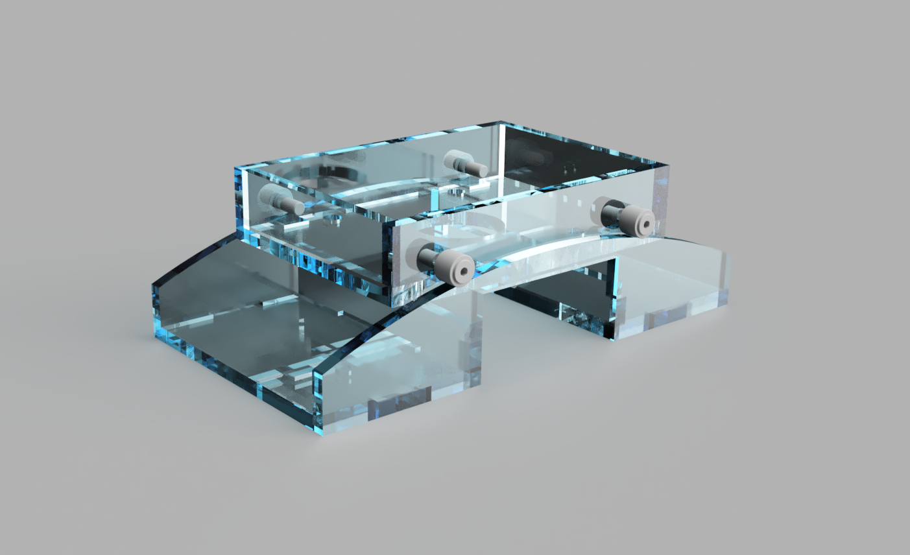

# Open Fretboard Radiusing Jig

Copyright KYLE RUSH 2022.

This source describes Open Hardware and is licensed under the CERN-OHL-P
v2

You may redistribute and modify this documentation and make products
using it under the terms of the CERN-OHL-P v2 (https:/cern.ch/cern-ohl).
This documentation is distributed WITHOUT ANY EXPRESS OR IMPLIED
WARRANTY, INCLUDING OF MERCHANTABILITY, SATISFACTORY QUALITY
AND FITNESS FOR A PARTICULAR PURPOSE. Please see the CERN-OHL-P v2
for applicable conditions

# Manufacturing and Assembly

## Laser Cutting

A sample laser cutting plan is provided at bosch-colt\2D Projections\laser-cutter-plan.vsdx.

Use 1/4 Acrylic for proven results. 1/4 MDF would also work presumably well.

Cut the shapes using the provided plan, and assemble them using Acrylic Cement or wood glue as appropriate.

## 3D printing

This was designed for laser cutting, as I'm able to get much more accurate results. If you're able to 3D print this successfully, you're welcome to update the instructions here.

## Hardware

Hardware for my prototype was obtained from McMaster-Carr. 

### Track Rollers

The router sled uses 1/2 diameter track rollers with a 1/4 shaft. This is what I used: https://www.mcmaster.com/3643K81/

It's improtant that the roller diameter is 1/2". The shaft diameter is not important, but the design may need to be altered to fit a different size shaft.

These track rollers could also be replaced with dowels, theoretically, as long as the diameter which rests on the guide is 1/2".

Washers and nuts should also be purchased for the track rollers

### Thumb Screws

The screws which attach to the router base are M4. I used 6mm M4 thumb screws.

https://www.mcmaster.com/92957A180/

# Usage

The fretboard blank should be dimensioned down to 1/4" or larger. It needs to sit at exactly 1 inch from the surface of the table.

To make it simple, I created a 1" x 3" x 20" piece of MDF by gluing two pieces of 1/2" laying around. This provides the "work surface" which you can attach the fretboard blank with double-sided tape.

Place the guide on top of the work surface. Set the router bit to exactly 1/4" below the router sled (this is important to get an exact radius).

Move the router back and forth of the fretboard blank to create the radius.

Move the jig along the blank and repeat the cut for the entire length.

# Design notes

The radius of the guide is not exactly 10". The bottom of the sled sits slightly below the guide radius, and the router bit extends 1/4 below the bottom of the sled. The radius of the guide curve is therefor slightly larger than 10".
